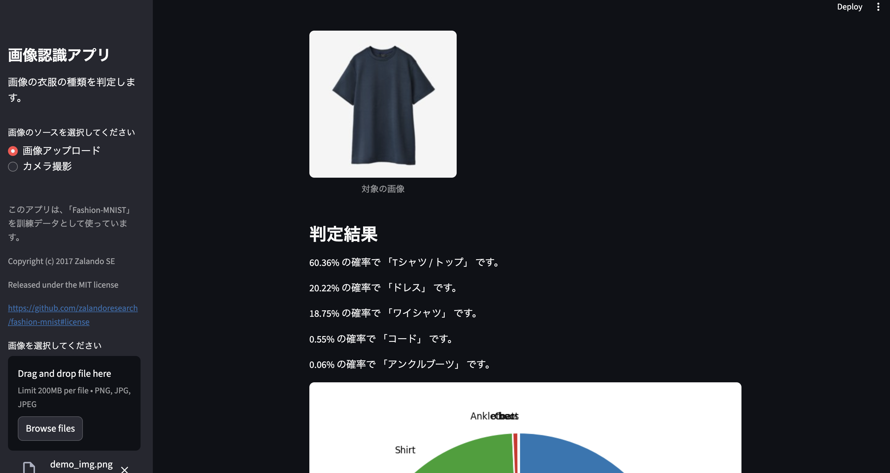

# sample-simple-ai-app-streamlit

## Machine Learning 環境

### 事前準備(ML環境)

```bash
cd ml

# CPU環境の場合
poetry install
# poetry install --without dev

# GPU環境の場合
#T.B.D
# poetry install
```

下記コマンドでKernelを用意する。コマンド実施後にVSCode(もしくはCursor)を再起動する。

```bash
poetry run python -m ipykernel install --user --name=ml-env --display-name "ml-env"
```

`ml/training.ipynb` を開き、右上のkernelから[Select Another Kernel > Python Environment > ml-env]の順に選択する。

### 実行方法(ML環境)

`ml/training.ipynb` を実行することで学習が実施され、`ml/model_param/latest_train_model.pth` に学習済みモデルが保存される。  
現状のノートブックでは、FashionMNISTの画像分類を学習する処理が記載されている。  
(コミットされている学習済みモデルは、このノートブックを実行して保存した学習済みモデルとなる)

## App 環境

### 事前準備(App環境)

App側ではCPU環境で動かす想定のため、GPU版のインストールは用意していない。

```bash
cp app
poetry install
```

### 実行方法(App環境)

makefileから実行できるようにしている。

```bash
poetry run make run
```

> NOTE  
> ベースのコマンドは `poetry run streamlit run app.py --server.port 8080` となるが、PYTHONPATH環境変数の設定も行うため、makefileを作成し処理をまとめている。

### 実行時の様子(App環境)


